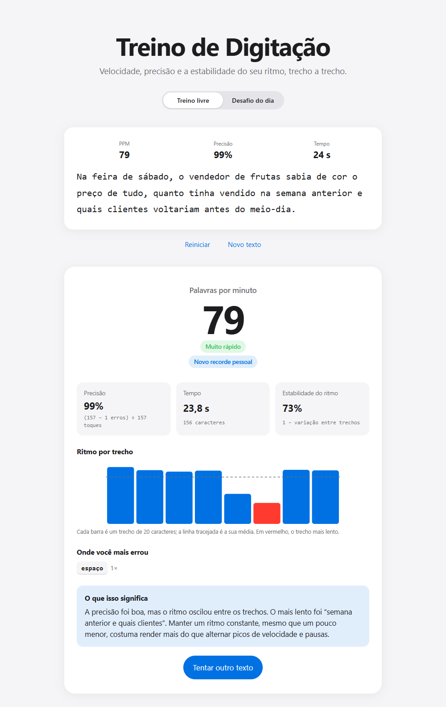

# Treino de Digitação

Mede velocidade, precisão e a estabilidade do ritmo de digitação, trecho a trecho, e diz onde focar para melhorar.

**Acesse:** https://gutemberg-vercosa.github.io/treino-digitacao/

<a href="https://gutemberg-vercosa.github.io/treino-digitacao/"></a>

## O que ele faz

- Mostra velocidade, precisão e tempo enquanto você digita, com o erro destacado na hora.
- Ao terminar, mostra:
  - **Palavras por minuto (PPM)**, contando só os caracteres certos.
  - **Precisão**, incluindo erros que foram corrigidos depois.
  - **Estabilidade do ritmo**: o texto é dividido em trechos de 20 caracteres, e a estabilidade é 1 menos o coeficiente de variação do PPM entre eles. É a mesma ideia de variabilidade usada no controle de processos.
  - Um gráfico do ritmo por trecho, com o trecho mais lento em destaque.
  - As teclas em que você mais errou.
  - Um diagnóstico do que priorizar: precisão, constância ou velocidade.
- Guarda o seu recorde pessoal no navegador.
- **Desafio do dia**: uma frase igual para todo mundo, que muda à meia-noite (horário de Brasília), com ranking das pessoas mais rápidas do dia.
- Funciona no celular: tocar no texto abre o teclado.

## Tecnologias

- TypeScript e Vite, sem frameworks.
- Vitest para os testes da lógica de medição (`src/sessao.test.ts`).
- GitHub Actions roda os testes, gera o build e publica no GitHub Pages a cada push.
- Layout mobile first, com tema claro e escuro automático.

- API do ranking em Cloudflare Workers, com banco SQL D1.

## Ranking e proteção contra trapaça

O site é estático, então o ranking fica numa API separada (`api/`). Para que ninguém envie um tempo falso:

- O **servidor mede o tempo**. No primeiro toque, o site avisa a API, que grava a hora de início. No envio, o PPM é calculado a partir dessa hora, e não do valor mostrado na tela.
- **Só a primeira tentativa do dia vale.** Recomeçar não zera o relógio, então repetir o desafio só piora o tempo.
- Envios acima de 250 PPM, com precisão abaixo de 90% ou depois de 10 minutos são recusados.
- Apelidos têm tamanho e caracteres limitados e passam por um filtro de palavrões.
- A API só aceita chamadas do próprio site (CORS) e usa consultas parametrizadas no banco.

## Estrutura

| Arquivo | Responsabilidade |
|---|---|
| `src/sessao.ts` | Lógica pura: estado de cada caractere, erros, PPM, precisão e ritmo por trecho |
| `src/desafio.ts` | Frase do dia, compartilhada entre site e API |
| `src/api.ts` | Chamadas à API do ranking |
| `src/main.ts` | Interface: captura da digitação, desafio, resultado e ranking |
| `src/textos.ts` | Textos do treino livre |
| `api/src/index.ts` | Rotas da API: início do desafio, envio do resultado e ranking |
| `api/src/regras.ts` | Validações: apelido, limites de PPM, precisão e tempo |
| `api/schema.sql` | Tabelas do banco |

## Rodando localmente

```bash
npm install
npm run dev    # servidor de desenvolvimento
npm test       # testes
npm run build  # build de produção em dist/
```

Para publicar a API (conta Cloudflare necessária):

```bash
cd api
npx wrangler d1 execute treino-digitacao --remote --file=schema.sql
npx wrangler deploy
```
